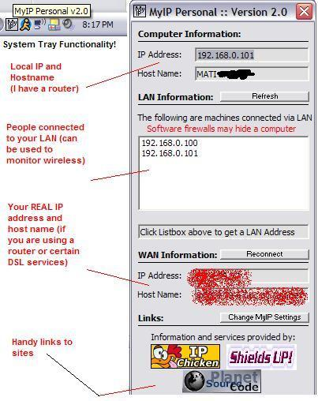



## MyIP Personal v2\.0

### Description

MyIP Personal is a pretty small application I created for helping my friends play online games (internet and LAN). Features include: Your REAL IP and Hostname, Detects all computers connected via LAN (helpful to make sure everyone had a successful connection) and resides in the system tray. As an added bonus it has a quick link to scan your ports for weaknesses and exploits.
 
### More Info
 

             |
---                |---
**Submitted On**   |2004-09-03 00:08:24
**By**             |[Mati Lurey](https://github.com/Planet-Source-Code/PSCIndex/blob/master/ByAuthor/mati-lurey.md)
**Level**          |Beginner
**User Rating**    |4.8 (38 globes from 8 users)
**Compatibility**  |VB 5\.0, VB 6\.0
**Category**       |[Internet/ HTML](https://github.com/Planet-Source-Code/PSCIndex/blob/master/ByCategory/internet-html__1-34.md)
**World**          |[Visual Basic](https://github.com/Planet-Source-Code/PSCIndex/blob/master/ByWorld/visual-basic.md)
**Archive File**   |[MyIP\_Perso178915932004\.zip](https://github.com/Planet-Source-Code/mati-lurey-myip-personal-v2-0__1-55990/archive/master.zip)

